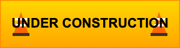
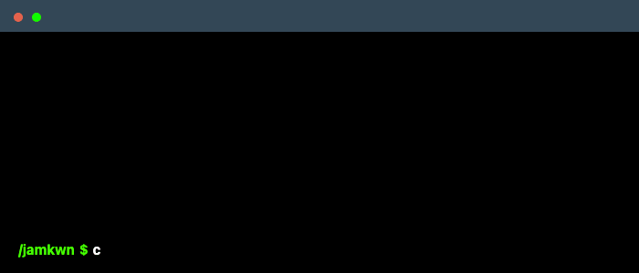

## Under Construction

    

<!--
**jamkwn/jamkwn** is a ✨ _special_ ✨ repository because its `README.md` (this file) appears on your GitHub profile.

Here are some ideas to get you started:

- 🔭 I’m currently working on ...
- 🌱 I’m currently learning ...
- 👯 I’m looking to collaborate on ...
- 🤔 I’m looking for help with ...
- 💬 Ask me about ...
- 📫 How to reach me: ...
- 😄 Pronouns: ...
- ⚡ Fun fact: ...
-->
<!--
 

-->
<!--
    Your own Terminal GIF can be created here -> https://www.terminalgif.com
-->

    

<!--
     My mission, because I'm a superhero!
-->
<!--
     This is the list of my skills and tools I am studying!
-->
### Main skills

### Studying

<!--
     I also have my own blog with useful information, check it out ^^
-->

### Publications
<!--

 
  
  

-->
More to follow, reflections on AI research and applications, and topics as it relates to healthcare.

